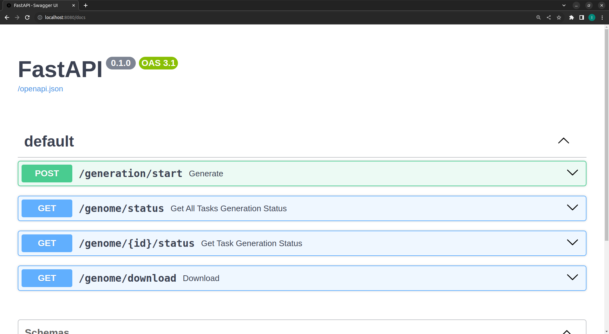
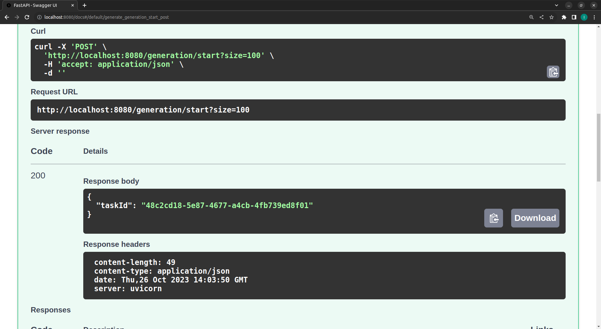
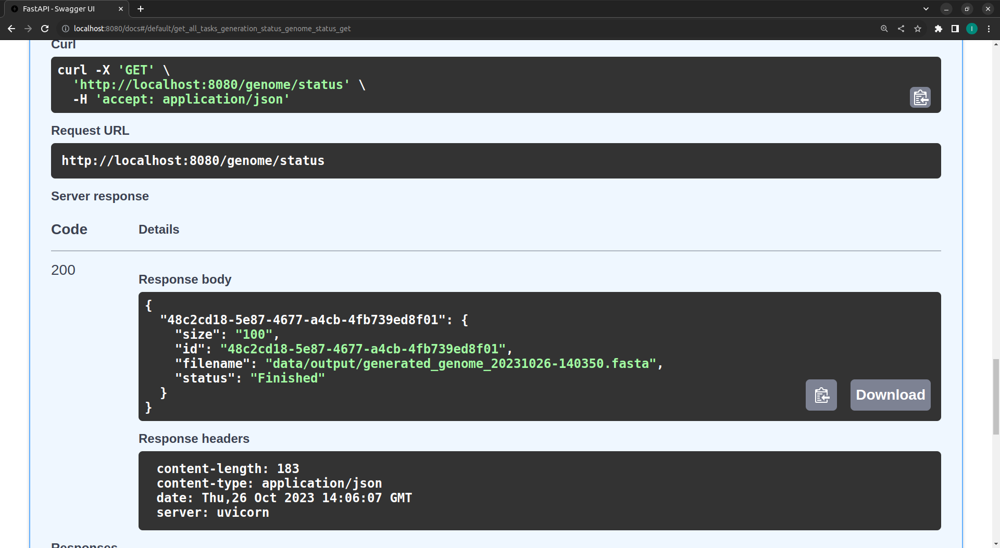
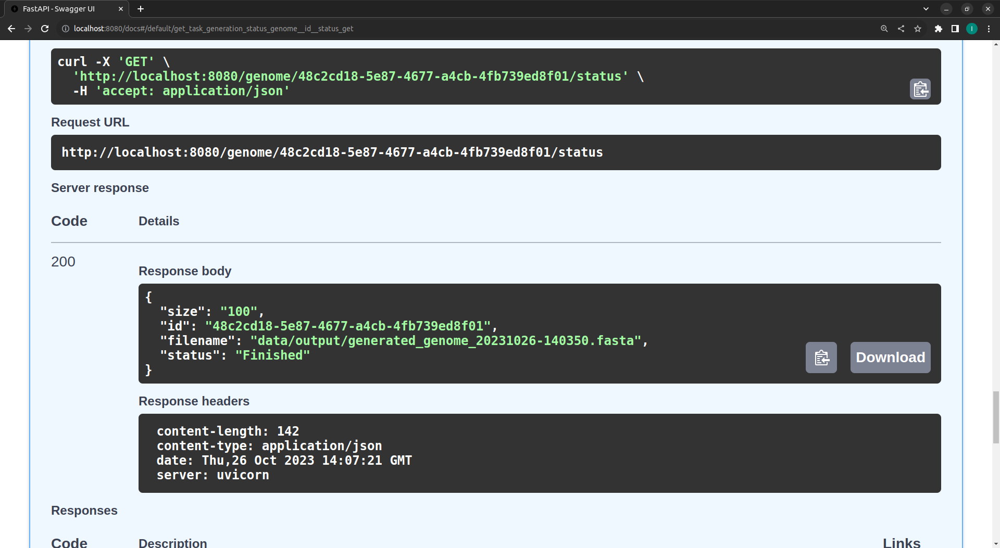
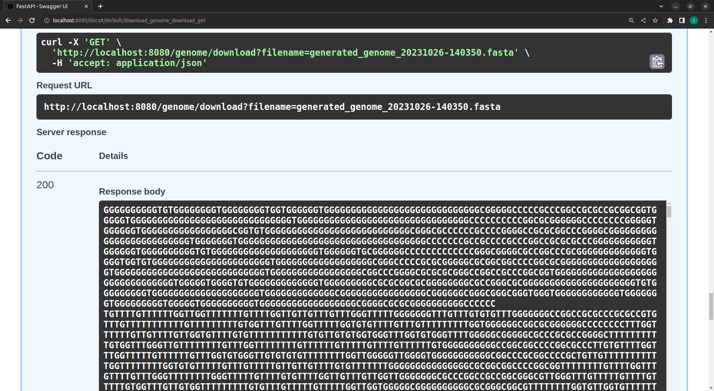

# Build

```make``` - build docker image (genome_generator) and run (port 8080)

```make build``` - build docker image

```make run``` - run docker image (port 8080)

```make stop``` - stop docker image

# REST API

```GET /docs``` - swagger



```POST /generation/start?size={size}``` - start generation, returns task id



```GET /genome/status``` - returns status of all generation tasks



```GET /genome/{id}/status``` - return status of specific generation task



```GET /genome/download?filename={filename}``` - downloads generated file

